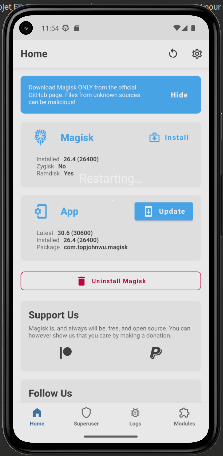
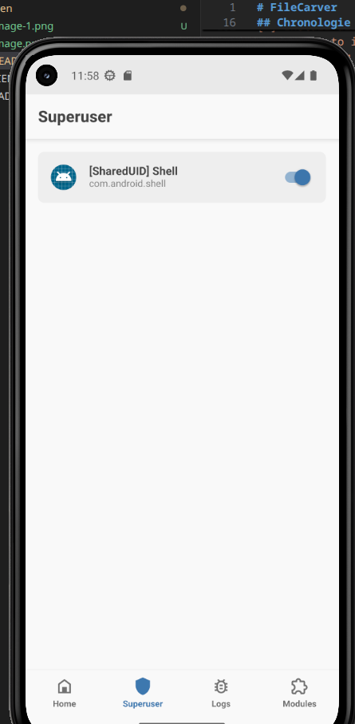

# FileCarver

## Installation de RootAVD
```bash
git clone https://gitlab.com/newbit/rootAVD.git
cd rootAVD
sudo chmod +x rootAVD.sh
```

**Chemin vers le AVD du Androidphone** : /home/julien/.var/app/com.google.AndroidStudio/config/.android/avd/Medium_Phone.avd/

**WorkingDirectories** : 
- le repo du projet
- ~/Git_Repos/rootAVD

## Chronologie

```bash
cd /home/julien/.var/app/com.google.AndroidStudio/config/.android/avd
ls
```

* Création du Pixel Android 13

```bash
# 1. Va dans le dossier de ton nouvel AVD
cd ~/.var/app/com.google.AndroidStudio/config/.android/avd/Pixel_5.avd

# 2. Affiche la ligne qui nous donne le chemin exact
cat config.ini | grep -E 'image.sysdir|android-'
image.sysdir.1=system-images/android-33/google_apis/x86_64/
target=android-33
```

* Trouver ramdisk.img pour 
```bash

ls ~/Android/Sdk/system-images/android-33/google_apis/x86_64/
 advancedFeatures.ini   build.prop   data   encryptionkey.img   kernel-ranchu   NOTICE.txt   package.xml   ramdisk.img   source.properties   system.img   userdata.img   vendor.img   VerifiedBootParams.textproto
 
```

* Démarrer la VM
 Lancer avec commande directement sans passer par AndroidStudio : 
 ```bash
 ANDROID_AVD_HOME=~/.var/app/com.google.AndroidStudio/config/.android/avd \
~/Android/Sdk/emulator/emulator -avd Pixel_5 -writable-system -no-snapshot &
```

* Vérif
```bash
~/Android/Sdk/platform-tools/adb devices
List of devices attached
emulator-5554	device
```

* Taper cette commande depuis le repo RootAVD
Ce script aura pour effet d'éteindre la VM Android, ce qui est normal. 
```bash
./rootAVD.sh system-images/android-33/google_apis/x86_64/ramdisk.img
```

Exemple : 

```bash
╭─julien@fedora ~/Git_Repos/rootAVD ‹master› 
╰─$ ./rootAVD.sh system-images/android-33/google_apis/x86_64/ramdisk.img
[!] and we are NOT in an emulator shell
[*] Set Directorys
[-] source.properties file exist
[*] AVD system-image Pkg.Revision=17
[-] Test if ADB SHELL is working
which: no adb in (/home/julien/Git_Repos/arsenal:/home/julien/.local/bin:/home/julien/.cargo/bin:/usr/local/bin:/usr/bin:/usr/local/sbin:/usr/sbin)
[!] ADB is not in your Path, try to:

export PATH=~/Android/Sdk/platform-tools:$PATH

[*] setting it, just during this session, for you
[-] Test if ADB SHELL is working
[*] ADB connection possible
[-] In any AVD via ADB, you can execute code without root in /data/data/com.android.shell
[*] Cleaning up the ADB working space
[*] Creating the ADB working space
[-] Magisk installer Zip exists already
[*] Push Magisk.zip into /data/data/com.android.shell/Magisk
[-] 
[*] create Backup File of ramdisk.img
[*] Push ramdisk.img into /data/data/com.android.shell/Magisk/ramdisk.img
[-] 
[*] Push rootAVD.sh into /data/data/com.android.shell/Magisk
[-] 
[-] run the actually Boot/Ramdisk/Kernel Image Patch Script
[*] from Magisk by topjohnwu and modded by NewBit XDA
[!] We are in a ranchu emulator shell
[-] Api Level Arch Detect
[-] Device Platform is x64 only
[-] Device SDK API: 33
[-] First API Level: 33
[-] The AVD runs on Android 13
[-] Switch to the location of the script file
[*] Looking for an unzip binary
[-] unzip binary found
[*] Extracting busybox and Magisk.zip via unzip ...
[*] Finding a working Busybox Version
[*] Testing Busybox /data/data/com.android.shell/Magisk/lib/x86/libbusybox.so
[!] Found a working Busybox Version
[!] BusyBox v1.36.1-Magisk (2023-09-02 05:30:11 PDT) multi-call binary.
[*] Move busybox from lib to workdir
[-] Checking AVDs Internet connection...
[!] AVD is online
[!] Checking available Magisk Versions
[?] Choose a Magisk Version to install and make it local
[s] (s)how all available Magisk Versions
[1] local stable '26.4' (ENTER)
[2] stable 30.6
[3] canary 30.6
[-] You choose Magisk local stable Version '26.4'
[*] Re-Run rootAVD in Magisk Busybox STANDALONE (D)ASH
[-] We are now in Magisk Busybox STANDALONE (D)ASH
[*] rootAVD with Magisk '26.4' Installer
[-] Get Flags
[*] System-as-root, keep dm/avb-verity
[-] Encrypted data, keep forceencrypt
[*] RECOVERYMODE=false
[-] KEEPVERITY=true
[*] KEEPFORCEENCRYPT=true
[-] copy all x86_64 files from /data/data/com.android.shell/Magisk/lib/x86_64 to /data/data/com.android.shell/Magisk
[-] copy 'stub.apk' from /data/data/com.android.shell/Magisk/assets to /data/data/com.android.shell/Magisk
[*] Detecting ramdisk.img compression
[!] Ramdisk.img uses lz4_legacy compression
[-] taken from shakalaca's MagiskOnEmulator/process.sh
[*] executing ramdisk splitting / extraction / repacking
[-] API level greater then 30
[*] Check if we need to repack ramdisk before patching ..
[-] Multiple cpio archives detected
[*] Unpacking ramdisk ..
[*] Searching for the real End of the 1st Archive
[-] Dumping from 0 to 1658643 ..
Detected format: [lz4_legacy]
[-] Dumping from 1658643 to 1719053 ..
Detected format: [lz4_legacy]
[*] Repacking ramdisk ..
[!] allowing MANAGE_EXTERNAL_STORAGE permissions to...
[-] Checking ramdisk STATUS=0
[-] Stock boot image detected
[*] Verifying Boot Image by its Kernel Release number:
[-] This AVD = 5.15.119-android13-8-00034-gd34029c8258b-ab10871489
[-]  Ramdisk = 5.15.119-android13-8-00034-gd34029c8258b-ab10871489
[!] Ramdisk is probably from this AVD
[-] Patching ramdisk
[*] Pre-init storage partition: metadata
[!] stub.apk is present, compress and add it to ramdisk
[*] adding overlay.d/sbin folders to ramdisk
Loading cpio: [ramdisk.cpio]
Create directory [overlay.d] (0750)
Create directory [overlay.d/sbin] (0750)
Dumping cpio: [ramdisk.cpio]
[!] patching the ramdisk with Magisk Init
Loading cpio: [ramdisk.cpio]
Add file [init] (100750)
Add file [overlay.d/sbin/magisk64.xz] (100644)
Add file [overlay.d/sbin/stub.xz] (100644)
Patch with flag KEEPVERITY=[true] KEEPFORCEENCRYPT=[true]
Loading cpio: [ramdisk.cpio.orig]
Backup [init] -> [.backup/init]
Record new entry: [overlay.d] -> [.backup/.rmlist]
Record new entry: [overlay.d/sbin] -> [.backup/.rmlist]
Record new entry: [overlay.d/sbin/magisk64.xz] -> [.backup/.rmlist]
Record new entry: [overlay.d/sbin/stub.xz] -> [.backup/.rmlist]
Create directory [.backup] (0000)
Add file [.backup/.magisk] (100000)
Dumping cpio: [ramdisk.cpio]
[*] repacking back to ramdisk.img format
[!] Rename Magisk.zip to Magisk.apk
[*] Pull ramdiskpatched4AVD.img into ramdisk.img
[-] 
[*] Pull Magisk.apk into 
[-] 
[*] Pull Magisk.zip into .
[-] 
[-] Clean up the ADB working space
[-] Install all APKs placed in the Apps folder
[*] Trying to install Apps/Magisk.apk
[*] Performing Streamed Install
[*] Success
[-] Shut-Down & Reboot (Cold Boot Now) the AVD and see if it worked
[-] Root and Su with Magisk for Android Studio AVDs
[-] Trying to shut down the AVD
[!] If the AVD doesn't shut down, try it manually!
[-] Modded by NewBit XDA - Jan. 2021
[!] Huge Credits and big Thanks to topjohnwu, shakalaca, vvb2060 and HuskyDG
```


* Retaper : 
```bash
ANDROID_AVD_HOME=~/.var/app/com.google.AndroidStudio/config/.android/avd \
~/Android/Sdk/emulator/emulator -avd Pixel_5 -writable-system -no-snapshot &
```

* Ouvrir l'app Magisk dans le Android, cliquer oui
la VM reboot



* Donner les droits à superuser


* sur le PC : 
```bash
~/Android/Sdk/platform-tools/adb shell
```
cela donnera le shell de l'Android

Exemple : 
```bash
╭─julien@fedora ~/Git_Repos/rootAVD ‹master› 
╰─$ ~/Android/Sdk/platform-tools/adb shell
emu64x:/ $ su
emu64x:/ # id
uid=0(root) gid=0(root) groups=0(root) context=u:r:magisk:s0
emu64x:/ # 
```


* taper : 
```bash
ls /data/data/
ls /dev/block/
```
Exemple : 

```bash
emu64x:/ # ls /data/data/
android                                                        com.android.storagemanager
android.auto_generated_rro_product__                           com.android.storagemanager.auto_generated_rro_product__
android.auto_generated_rro_vendor__                            com.android.systemui
com.android.backupconfirm                                      com.android.systemui.auto_generated_rro_product__
com.android.bips                                               com.android.systemui.auto_generated_rro_vendor__
com.android.bips.auto_generated_rro_product__                  com.android.systemui.emulation.pixel_3
com.android.bluetooth                                          com.android.systemui.emulation.pixel_3_xl
com.android.bluetoothmidiservice                               com.android.systemui.emulation.pixel_3a
com.android.bookmarkprovider                                   com.android.systemui.emulation.pixel_3a_xl
com.android.calllogbackup                                      com.android.systemui.emulation.pixel_4
com.android.camera2                                            com.android.systemui.emulation.pixel_4_xl
com.android.cameraextensions                                   com.android.systemui.emulation.pixel_4a
com.android.carrierconfig                                      com.android.systemui.emulation.pixel_5
com.android.carrierconfig.auto_generated_rro_product__         com.android.systemui.emulation.pixel_6
com.android.carrierconfig.auto_generated_rro_vendor__          com.android.systemui.emulation.pixel_6_pro
com.android.carrierdefaultapp                                  com.android.systemui.emulation.pixel_6a
com.android.cellbroadcastreceiver                              com.android.systemui.emulation.pixel_7
com.android.certinstaller                                      com.android.systemui.emulation.pixel_7_pro
com.android.chrome                                             com.android.systemui.plugin.globalactions.wallet
com.android.companiondevicemanager                             com.android.theme.font.notoserifsource
com.android.cts.ctsshim                                        com.android.traceur
com.android.cts.priv.ctsshim                                   com.android.traceur.auto_generated_rro_product__
com.android.dreams.basic                                       com.android.vending
com.android.dynsystem                                          com.android.vpndialogs
com.android.egg                                                com.android.wallpaper.livepicker
com.android.emergency                                          com.android.wallpaperbackup
com.android.emergency.auto_generated_rro_product__             com.android.wallpapercropper
com.android.emulator.multidisplay                              com.breel.wallpapers18
com.android.emulator.radio.config                              com.google.android.adservices.api
com.android.externalstorage                                    com.google.android.apps.customization.pixel
com.android.htmlviewer                                         com.google.android.apps.docs
com.android.imsserviceentitlement                              com.google.android.apps.maps
com.android.inputdevices                                       com.google.android.apps.messaging
com.android.intentresolver                                     com.google.android.apps.nexuslauncher
com.android.internal.display.cutout.emulation.corner           com.google.android.apps.photos
com.android.internal.display.cutout.emulation.double           com.google.android.apps.restore
com.android.internal.display.cutout.emulation.emu01            com.google.android.apps.wallpaper
com.android.internal.display.cutout.emulation.hole             com.google.android.apps.wallpaper.nexus
com.android.internal.display.cutout.emulation.tall             com.google.android.apps.wellbeing
com.android.internal.display.cutout.emulation.waterfall        com.google.android.apps.youtube.music
com.android.internal.emulation.pixel_2_xl                      com.google.android.as
com.android.internal.emulation.pixel_3                         com.google.android.as.oss
com.android.internal.emulation.pixel_3_xl                      com.google.android.bluetooth
com.android.internal.emulation.pixel_3a                        com.google.android.calendar
com.android.internal.emulation.pixel_3a_xl                     com.google.android.captiveportallogin
com.android.internal.emulation.pixel_4                         com.google.android.cellbroadcastreceiver
com.android.internal.emulation.pixel_4_xl                      com.google.android.cellbroadcastservice
com.android.internal.emulation.pixel_4a                        com.google.android.configupdater
com.android.internal.emulation.pixel_5                         com.google.android.connectivity.resources
com.android.internal.emulation.pixel_6                         com.google.android.connectivity.resources.goldfish.overlay
com.android.internal.emulation.pixel_6_pro                     com.google.android.contacts
com.android.internal.emulation.pixel_6a                        com.google.android.deskclock
com.android.internal.emulation.pixel_7                         com.google.android.dialer
com.android.internal.emulation.pixel_7_pro                     com.google.android.documentsui
com.android.internal.systemui.navbar.gestural                  com.google.android.ext.services
com.android.internal.systemui.navbar.gestural_extra_wide_back  com.google.android.ext.shared
com.android.internal.systemui.navbar.gestural_narrow_back      com.google.android.feedback
com.android.internal.systemui.navbar.gestural_wide_back        com.google.android.gm
com.android.internal.systemui.navbar.threebutton               com.google.android.gms
com.android.internal.systemui.navbar.twobutton                 com.google.android.gms.supervision
com.android.keychain                                           com.google.android.googlequicksearchbox
com.android.localtransport                                     com.google.android.gsf
com.android.location.fused                                     com.google.android.hotspot2.osulogin
com.android.managedprovisioning                                com.google.android.ims
com.android.managedprovisioning.auto_generated_rro_product__   com.google.android.inputmethod.latin
com.android.mms.service                                        com.google.android.markup
com.android.mtp                                                com.google.android.marvin.talkback
com.android.musicfx                                            com.google.android.marvin.talkbackoverlay
com.android.nfc                                                com.google.android.modulemetadata
com.android.nfc.auto_generated_rro_product__                   com.google.android.nearby.halfsheet
com.android.ons                                                com.google.android.networkstack
com.android.pacprocessor                                       com.google.android.networkstack.tethering
com.android.phone                                              com.google.android.networkstack.tethering.emulator
com.android.phone.auto_generated_rro_product__                 com.google.android.odad
com.android.phone.auto_generated_rro_vendor__                  com.google.android.ondevicepersonalization.services
com.android.printspooler                                       com.google.android.onetimeinitializer
com.android.providers.blockednumber                            com.google.android.overlay.googleconfig
com.android.providers.calendar                                 com.google.android.overlay.googlewebview
com.android.providers.contacts                                 com.google.android.overlay.permissioncontroller
com.android.providers.contacts.auto_generated_rro_product__    com.google.android.overlay.pixelconfigcommon
com.android.providers.downloads                                com.google.android.packageinstaller
com.android.providers.downloads.ui                             com.google.android.partnersetup
com.android.providers.media                                    com.google.android.permissioncontroller
com.android.providers.partnerbookmarks                         com.google.android.printservice.recommendation
com.android.providers.settings                                 com.google.android.projection.gearhead
com.android.providers.settings.auto_generated_rro_product__    com.google.android.providers.media.module
com.android.providers.settings.auto_generated_rro_vendor__     com.google.android.safetycenter.resources
com.android.providers.telephony                                com.google.android.sdksetup
com.android.providers.telephony.auto_generated_rro_product__   com.google.android.settings.intelligence
com.android.providers.userdictionary                           com.google.android.setupwizard
com.android.proxyhandler                                       com.google.android.soundpicker
com.android.remoteprovisioner                                  com.google.android.systemui.gxoverlay
com.android.se                                                 com.google.android.tag
com.android.server.telecom                                     com.google.android.trichromelibrary_541412337
com.android.server.telecom.auto_generated_rro_product__        com.google.android.tts
com.android.settings                                           com.google.android.uwb.resources
com.android.settings.auto_generated_rro_product__              com.google.android.webview
com.android.sharedstoragebackup                                com.google.android.wifi.dialog
com.android.shell                                              com.google.android.wifi.resources
com.android.simappdialog                                       com.google.android.youtube
com.android.simappdialog.auto_generated_rro_product__          com.google.mainline.adservices
com.android.soundpicker                                        com.google.mainline.telemetry
com.android.stk                                                com.topjohnwu.magisk
emu64x:/ # ls /dev/block/

by-name  dm-15  dm-23  dm-32  dm-8    loop14  loop20  loop27  loop33  loop4   loop46  mapper  ram13  ram6  vdb   vold
dm-0     dm-16  dm-24  dm-33  loop0   loop15  loop21  loop28  loop34  loop40  loop47  pci     ram14  ram7  vdc   zram0
dm-1     dm-19  dm-25  dm-34  loop1   loop16  loop22  loop29  loop35  loop41  loop5   ram0    ram15  ram8  vdd
dm-10    dm-2   dm-26  dm-4   loop10  loop17  loop23  loop3   loop36  loop42  loop6   ram1    ram2   ram9  vdd1
dm-11    dm-20  dm-27  dm-5   loop11  loop18  loop24  loop30  loop37  loop43  loop7   ram10   ram3   vda   vde
dm-12    dm-21  dm-28  dm-6   loop12  loop19  loop25  loop31  loop38  loop44  loop8   ram11   ram4   vda1  vde1
dm-14    dm-22  dm-3   dm-7   loop13  loop2   loop26  loop32  loop39  loop45  loop9   ram12   ram5   vda2  vdf
emu64x:/ # 
```
* ls /dev/block/by-name/
Sert à lister les partitions. 

Exemple : 

```bash
emu64x:/ # ls /dev/block/by-name/
metadata  super  vbmeta  vda  vdd
```

* puis 
```bash
emu64x:/ # ls /dev/block/mapper/
by-uuid                    com.android.conscrypt      com.android.neuralnetworks           com.android.sdkext     system-verity
com.android.adbd           com.android.extservices    com.android.ondevicepersonalization  com.android.tethering  system_dlkm
com.android.adservices     com.android.ipsec          com.android.os.statsd                com.android.uwb        system_ext
com.android.appsearch      com.android.media          com.android.permission               com.android.wifi       userdata
com.android.art            com.android.media.swcodec  com.android.resolv                   product                vendor
com.android.cellbroadcast  com.android.mediaprovider  com.android.scheduling               system
emu64x:/ # 
```

* Extraire la partition rechercher vers le PC hôte
Taper cette commande dans un autre terminal : 
```bash
~/Android/Sdk/platform-tools/adb pull /dev/block/mapper/userdata ~/userdata.img
```
Mais cette commande ne va pas marcher

* solution : à taper dans le shell Android
```bash
dd if=/dev/block/mapper/userdata of=/data/local/tmp/userdata.img bs=4096
```
```bash
dd: /data/local/tmp/userdata.img: write error: No space left on device
1309868+0 records in
1309867+0 records out
5365215232 bytes (4.9 G) copied, 4.974302 s, 1.0 G/s
1|emu64x:/ # 
```

* A taper dans l'autre terminal 
```bash
~/Android/Sdk/platform-tools/adb pull /data/local/tmp/userdata.img ~/userdata.img
```

exemple : 
```bash
╭─julien@fedora ~/Git_Repos/rootAVD ‹master› 
╰─$ ~/Android/Sdk/platform-tools/adb pull /data/local/tmp/userdata.img ~/userdata.img                                                     1 ↵
/data/local/tmp/userdata.img: 1 file pulled, 0 skipped. 235.1 MB/s (5365215232 bytes in 21.763s)
╭─julien@fedora ~/Git_Repos/rootAVD ‹master› 
╰─$ 
```

* Intéragir avec l'image copié : 
```bash
╭─julien@fedora ~/Git_Repos/rootAVD ‹master› 
╰─$ file ~/userdata.img                                                                                                                   1 ↵
/home/julien/userdata.img: Linux rev 1.0 ext4 filesystem data, UUID=57f8f4bc-abf4-655f-bf67-946fc0f9f25b (needs journal recovery) (extents) (large files)
╭─julien@fedora ~/Git_Repos/rootAVD ‹master› 
╰─$ sudo mkdir /mnt/userdata
sudo mount -o loop,ro ~/userdata.img /mnt/userdata
ls /mnt/userdata
mount: /mnt/userdata: wrong fs type, bad option, bad superblock on /dev/loop0, missing codepage or helper program, or other error.
       dmesg(1) may have more information after failed mount system call.
╭─julien@fedora ~/Git_Repos/rootAVD ‹master› 
╰─$ 
```

* Problème de montage : 
```bash
╭─julien@fedora ~/Git_Repos/rootAVD ‹master› 
╰─$ sudo dmesg | tail -20                                                                                                                32 ↵
[10676.539400] ath11k_pci 0000:02:00.0: msdu_done bit in attention is not set
[10677.462704] ath11k_pci 0000:02:00.0: msdu_done bit in attention is not set
[10677.565281] ath11k_pci 0000:02:00.0: msdu_done bit in attention is not set
[10678.478895] ath11k_pci 0000:02:00.0: msdu_done bit in attention is not set
[10680.429859] ath11k_pci 0000:02:00.0: msdu_done bit in attention is not set
[10680.524937] ath11k_pci 0000:02:00.0: msdu_done bit in attention is not set
[10690.874870] ath11k_pci 0000:02:00.0: msdu_done bit in attention is not set
[10699.675191] ath11k_pci 0000:02:00.0: msdu_done bit in attention is not set
[10701.524373] ath11k_pci 0000:02:00.0: msdu_done bit in attention is not set
[10707.975207] ath11k_pci 0000:02:00.0: msdu_done bit in attention is not set
[10712.778113] ath11k_pci 0000:02:00.0: msdu_done bit in attention is not set
[10721.382087] ath11k_pci 0000:02:00.0: msdu_done bit in attention is not set
[10722.823128] ath11k_pci 0000:02:00.0: msdu_done bit in attention is not set
[10724.148077] loop0: detected capacity change from 0 to 10478936
[10724.149989] EXT4-fs (loop0): Using encoding defined by superblock: utf8-12.1.0 with flags 0x0
[10724.149993] EXT4-fs (loop0): bad geometry: block count 1572864 exceeds size of device (1309867 blocks)
[10724.974276] ath11k_pci 0000:02:00.0: msdu_done bit in attention is not set
[10727.936301] ath11k_pci 0000:02:00.0: msdu_done bit in attention is not set
[10732.748558] ath11k_pci 0000:02:00.0: msdu_done bit in attention is not set
[10735.113619] ath11k_pci 0000:02:00.0: msdu_done bit in attention is not set
```

* Lancer cette commande pour avoir un fichier de dump complet
```bash
╭─julien@fedora ~/Git_Repos/rootAVD ‹master› 
╰─$ ~/Android/Sdk/platform-tools/adb shell su -c "dd if=/dev/block/mapper/userdata bs=4096" > ~/userdata.img                              8 ↵
1572864+0 records in
1572864+0 records out
6442450944 bytes (6.0 G) copied, 32.393843 s, 190 M/s
```

* taper : 
```bash
╭─julien@fedora ~/Git_Repos/rootAVD ‹master› 
╰─$ file ~/userdata.img
sudo e2fsck -fy ~/userdata.img
/home/julien/userdata.img: Linux rev 1.0 ext4 filesystem data, UUID=57f8f4bc-abf4-655f-bf67-946fc0f9f25b (needs journal recovery) (extents) (large files)
[sudo] Mot de passe de julien : 
e2fsck 1.47.3 (8-Jul-2025)
/home/julien/userdata.img : récupération du journal
Lors de l'effacement de l'i-noeud orphelin 133633 (uid=10112, gid=10112, mode=0100600, taille=0)
Lors de l'effacement de l'i-noeud orphelin 133632 (uid=10112, gid=10112, mode=0100600, taille=0)
Passe 1 : vérification des i-noeuds, des blocs et des tailles
le bloc 493906 d'attribut étendu a un compteur de référence 171, devrait être 157. Corriger ? oui

le bloc 1049102 d'attribut étendu a un compteur de référence 362, devrait être 360. Corriger ? oui

le bloc 1050258 d'attribut étendu a un compteur de référence 9, devrait être 7. Corriger ? oui

le bloc 524973 d'attribut étendu a un compteur de référence 913, devrait être 914. Corriger ? oui

le bloc 525593 d'attribut étendu a un compteur de référence 592, devrait être 595. Corriger ? oui

le bloc 1050240 d'attribut étendu a un compteur de référence 2, devrait être 3. Corriger ? oui

Passe 2 : vérification de la structure des répertoires
Entrée « M-iM-`3M-7^VM-3&E^BM-^QM-[!M-4c=M-^K » dans /system/^^f^IM-XM-g~^I^Ac{Q,^R}EM-H/M-^QM-(^LB^RM-KM-!M-UM-DpM-^DM-dM-`M-mdM-E (262150) référence l'i-noeud 263036 trouvé dans la zone d'i-noeuds non utilisés du groupe 32.
Corriger ? oui

L'entrée « M-iM-`3M-7^VM-3&E^BM-^QM-[!M-4c=M-^K » dans /system/^^f^IM-XM-g~^I^Ac{Q,^R}EM-H/M-^QM-(^LB^RM-KM-!M-UM-DpM-^DM-dM-`M-mdM-E (262150) a un type de fichier incorrect (était 1, devrait être 0).
Corriger ? oui

L'entrée « M-^V^NM-W4M-zMM-6M-`^U:M-\KM-^OM-;^ZW » dans /system/^^M-@M-BM-^[nM-MM-AAw^_QM-qM-_7M-^MM-^T (262427) a un type de fichier incorrect (était 1, devrait être 0).
Corriger ? oui

[QUOTA WARNING] Usage inconsistent for ID 1000:actual (355856384, 1614) != expected (355909632, 1614)
[QUOTA WARNING] Usage inconsistent for ID 10107:actual (2871296, 51) != expected (2875392, 52)
[QUOTA WARNING] Usage inconsistent for ID 10112:actual (303104, 34) != expected (311296, 34)
[QUOTA WARNING] Usage inconsistent for ID 10117:actual (4182016, 73) != expected (4177920, 72)
[QUOTA WARNING] Usage inconsistent for ID 10174:actual (290816, 20) != expected (294912, 21)
Mise à jour de l'information de quota pour le type de quota 0 ? oui

[QUOTA WARNING] Usage inconsistent for ID 1000:actual (510648320, 1450) != expected (510701568, 1450)
[QUOTA WARNING] Usage inconsistent for ID 10112:actual (270336, 30) != expected (278528, 30)
[QUOTA WARNING] Usage inconsistent for ID 20107:actual (32768, 4) != expected (36864, 5)
[QUOTA WARNING] Usage inconsistent for ID 20117:actual (49152, 8) != expected (45056, 7)
[QUOTA WARNING] Usage inconsistent for ID 20174:actual (36864, 5) != expected (40960, 6)
Mise à jour de l'information de quota pour le type de quota 1 ? oui

[QUOTA WARNING] Usage inconsistent for ID 0:actual (6227935232, 9145) != expected (6228000768, 9146)
Mise à jour de l'information de quota pour le type de quota 2 ? oui

Re-démarrons e2fsck depuis le début...
Passe 1 : vérification des i-noeuds, des blocs et des tailles
le bloc 1050258 d'attribut étendu a un compteur de référence 7, devrait être 8. Corriger ? oui

Passe 2 : vérification de la structure des répertoires
L'entrée « M-iM-`3M-7^VM-3&E^BM-^QM-[!M-4c=M-^K » dans /system/^^f^IM-XM-g~^I^Ac{Q,^R}EM-H/M-^QM-(^LB^RM-KM-!M-UM-DpM-^DM-dM-`M-mdM-E (262150) a un i-noeud effacé/non utilisé 263036. Effacer ? oui

L'entrée « M-^V^NM-W4M-zMM-6M-`^U:M-\KM-^OM-;^ZW » dans /system/^^M-@M-BM-^[nM-MM-AAw^_QM-qM-_7M-^MM-^T (262427) a un i-noeud effacé/non utilisé 263040. Effacer ? oui

Passe 3 : vérification de la connectivité des répertoires
Passe 4 : vérification des compteurs de référence
I-noeud 123441 non attaché
Connecter à /lost+found ? oui

le compteur de référence de l'i-noeud 123441 est 2, devrait être 1. Corriger ? oui

I-noeud 262985 non attaché
Connecter à /lost+found ? oui

le compteur de référence de l'i-noeud 262985 est 2, devrait être 1. Corriger ? oui

I-noeud 262990 non attaché
Connecter à /lost+found ? oui

le compteur de référence de l'i-noeud 262990 est 2, devrait être 1. Corriger ? oui

I-noeud 263041 non attaché
Connecter à /lost+found ? oui

le compteur de référence de l'i-noeud 263041 est 2, devrait être 1. Corriger ? oui

Passe 5 : vérification de l'information du sommaire de groupe
différences de bitmap de blocs :  -627164 -(820449--820451) +(820527--820533) +820845 -(1053012--1053021)
Corriger ? oui

Le décompte des blocs libres est erroné pour le groupe n°19 (413, décompté=414).
Corriger ? oui

Le décompte des blocs libres est erroné pour le groupe n°25 (1192, décompté=1187).
Corriger ? oui

Le décompte des blocs libres est erroné pour le groupe n°32 (632, décompté=642).
Corriger ? oui

Le décompte des blocs libres est erroné (6042, décompté=7862).
Corriger ? oui

différences de bitmap d'i-noeuds :  +263041
Corriger ? oui

Le décompte des i-noeuds libres est erroné pour le groupe n°12 (7814, décompté=7815).
Corriger ? oui

Le décompte des i-noeuds libres est erroné pour le groupe n°32 (7305, décompté=7304).
Corriger ? oui

Le décompte des i-noeuds libres est erroné (385394, décompté=384043).
Corriger ? oui

[QUOTA WARNING] Usage inconsistent for ID 1000:actual (355889152, 1615) != expected (355856384, 1614)
Mise à jour de l'information de quota pour le type de quota 0 ? oui

[QUOTA WARNING] Usage inconsistent for ID 1000:actual (510681088, 1451) != expected (510648320, 1450)
Mise à jour de l'information de quota pour le type de quota 1 ? oui

[QUOTA WARNING] Usage inconsistent for ID 0:actual (6227968000, 9146) != expected (6227935232, 9145)
Mise à jour de l'information de quota pour le type de quota 2 ? oui


/home/julien/userdata.img: ***** LE SYSTÈME DE FICHIERS A ÉTÉ MODIFIÉ *****
/home/julien/userdata.img : 9173/393216 fichiers (2.7% non contigus), 1565002/1572864 blocs
```

* l'image est propre, on peut la monter : 
```bash
sudo mount -o loop,ro ~/userdata.img /mnt/userdata
ls /mnt/userdata
```
* Montage de l'image disque
```bash
╭─julien@fedora ~/Git_Repos/rootAVD ‹master› 
╰─$ sudo mount -o loop,ro ~/userdata.img /mnt/userdata
ls /mnt/userdata
 adb             app-staging    fonts                 mediadrm      preloads                    system        vendor_ce
 anr             backup         gsi                   misc          property                    system_ce     vendor_de
 apex            bootanim       gsi_persistent_data   misc_ce       resource-cache              system_de    
 app             bootchart      incremental           misc_de       rollback                    tombstones   
 app-asec       󰃨 cache          local                 nfc           rollback-history            unencrypted  
 app-ephemeral   dalvik-cache   local.prop            ota           rollback-observer           user         
 app-lib         data           lost+found            ota_package   server_configurable_flags   user_de      
 app-private     drm            media                 per_boot      ss                         󰫦 vendor       
╭─julien@fedora ~/Git_Repos/rootAVD ‹master› 
╰─$ 
```

